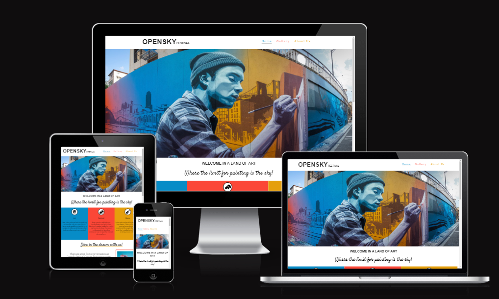
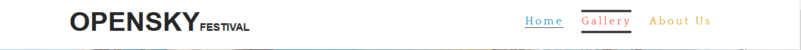
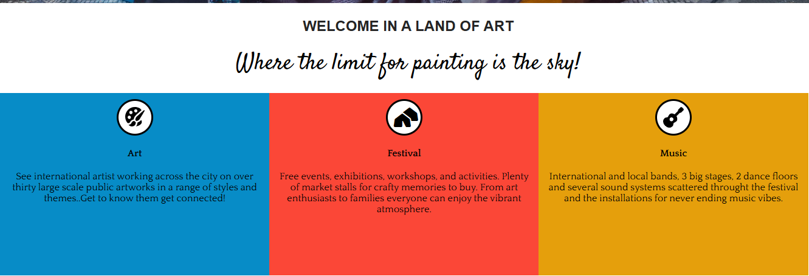
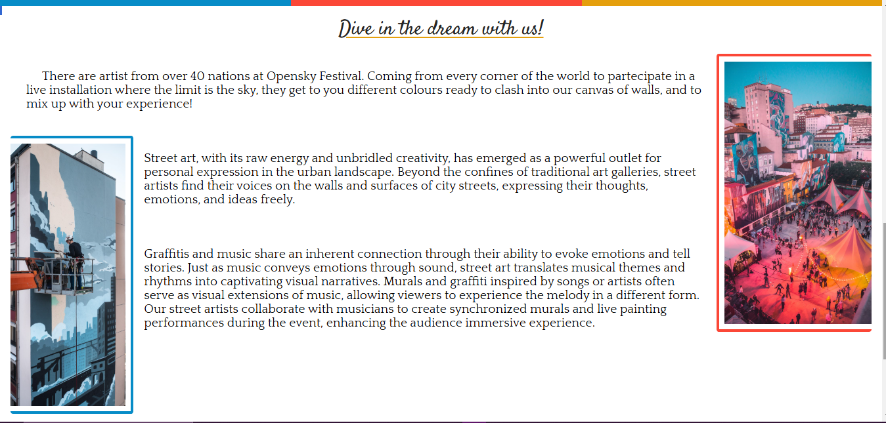
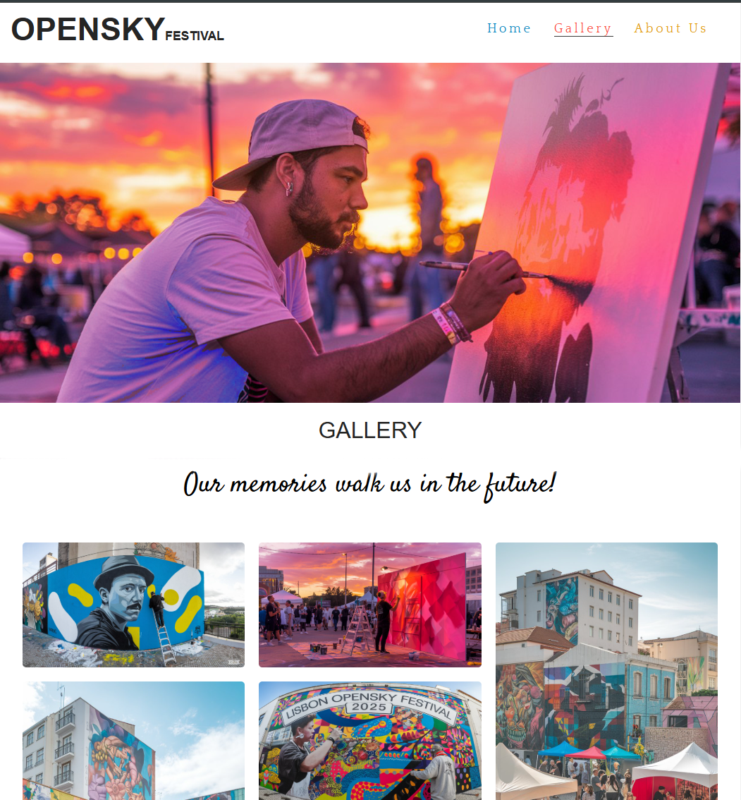
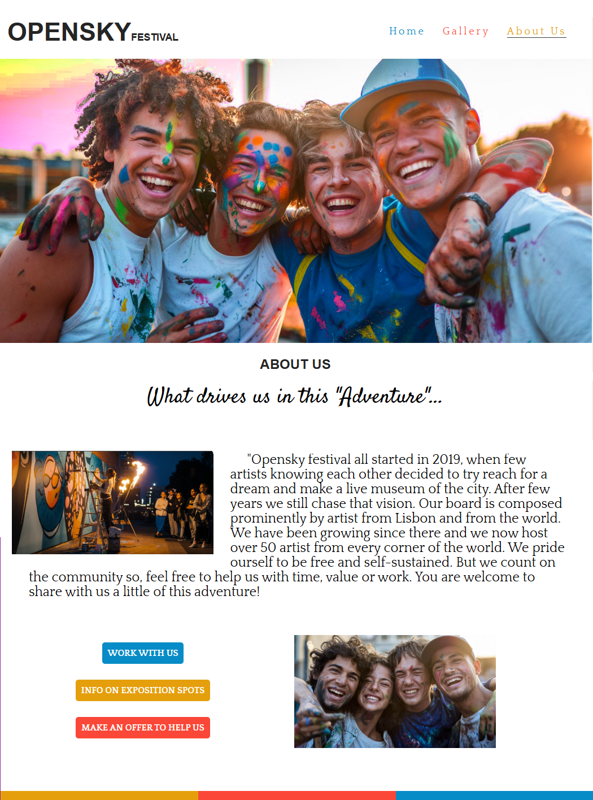
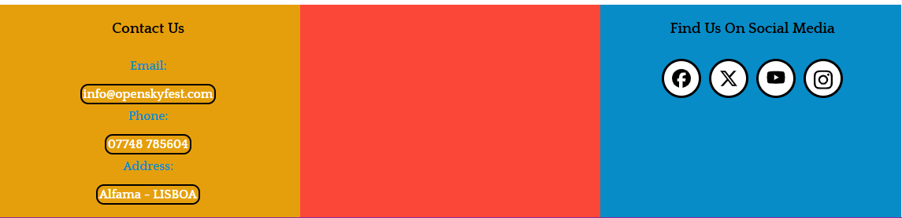
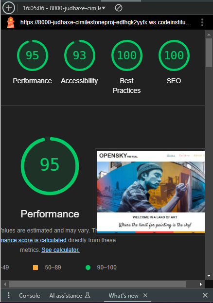

About Sustainable Life
----------------------

Opensky Festival is a website fully committed to promoting street art festival in the city of Lisbon. The website aims to encourage individuals to partecipate at any level in the great adventure of an outdoor museum scattered around the city; making arts and daily life mixing up in a positive vibe.

Screenshots
-----------

User Stories
------------

As a first-time visitor, I expect to navigate through the site with ease and get curious and find comprehensive information and contacts to interact with the festival organization.

As a returning visitor, I expect to receive regular updates and articles on the development of the festival.

This website is considered the first step in a strategy to gain an online presence, to be developed in further coverage and better interactivity of the services still to be developed.

Design
------

Our website features a clean and modern design with a focus on art and normal people. Its simple layout and ample white space enhance the readability and user experience of the site. The utilization of colours and imagery aligns with the brand's artistic ethos and with a fresh and crispy feeling in line with the vibrant energy of street art.

Color Scheme
------------

We incorporated peculiar palette colours recalling our hero image and we three different gammas of colour to underline the lively vibe of freedom to paint and colour your life. through imagery and colours I tried to give the site a consistent vibe to all the pages of the site.

Typography
----------

The font 'Quattrocento' used for all headings and paragraphs, is with clean lines, generating a minimalist and modern look for the website. The use of the font 'Satisfy' is use for some unusual subheading with a graphic purpose to give a visual break to the site looking and to give a hint of our artsy vibe to the user experience.

Imagery
-------

The website incorporates images that align with the brand's artistic ethos showing art jobs and work in progress of street artists. The use of warming artsy images throughout the site helps create an immersive and engaging user experience.

Features
--------

-   Fully Responsive Design - The website is designed to be responsive to a variety of devices, such as mobile phones, tablets, laptops, and desktop computers.

-   Interactive Navigation Menu - The easy-to-use navigation menu allows users to navigate around the site with ease. It features a hover effect to encourage users to interact and navigate through the website.

-   The "Welcome in a land of art" feature highlights the main ways Opensky Festival has to offer to the community. The section includes three key areas: Art, Festival and Music. This feature quickly establishes the festival's aim to provide a comprehensive and eclectic experience for those interested in it.

-   The "Dive in the dream with us" section on the website showcases a briefly view on street art world and on the peculiarity of street art show in Opensky Festival, to be attractive for users new to this world and more experienced users at the same time. 

-   The "Gallery" page provides a concise and selected list of images to give a more direct impression of our past editions vibe and to give a more immersive feeling of what next one is gonna be.
Screenshot of Gallery Page

-   The "About Us" page includes information on the organization of the festival, the board of street artist responsible for the art direction of the event and put in place helpfull link to partecipate at the event either working with us, renting exposition spots or simply supporting with offers.

-   The footer section of Opensky Festival's website includes links to relevant social media sites, allowing users to easily navigate to them in a new tab. These links are valuable to the user, as they encourage them to stay connected with Opensky Festival through various social media platforms.

Languages, Tools & Technologies Used
------------------------------------

-   HTML5
-   CSS

##### Google Fonts

-   We sourced the fonts, 'Quattrocento' and 'Satisfy' from Google Fonts.

##### Font Awesome

-   We integrated Font Awesome icons into the footer to improve the user experience.

##### Git

-   We utilized Git for version control, allowing for easy 'commit' and 'push' commands through the terminal.

##### Github

-   The code was stored on Github for a seamless and collaborative workflow.

## Deployment

### GitHub Pages

#### To deploy the site through GitHub pages, follow these steps:

* Log in to GitHub and navigate to the GitHub Repository.

* Click on the gear icon for settings.

* Find the GitHub Pages section and click on the 'Check it out here!' link.

* Under the Source header, select 'main' from the dropdown menu and choose the folder '/ (root)'.

* Click on Save.

* After the page refreshes, locate the published website link found under the GitHub Pages header.

### Forking the GitHub Repository

#### If you wish to create a safe copy of the project to experiment with changes, follow these steps:

* Log in to GitHub and navigate to the GitHub Repository.

* Click the "Fork" button near the top of the page to create a copy of the repository.

### Making a Local Clone

* Under "Clone with HTTPS", click the clipboard icon to copy the link.

* Open Git Bash and change the current working directory to the location where you want the cloned directory.

* Type 'git clone', add a space, and paste the URL that was copied earlier (in step 4). Press enter to create a clone.

For a more detailed guide with screenshots, click [here.](https://docs.github.com/en/repositories/creating-and-managing-repositories/cloning-a-repository#cloning-a-repository-to-github-desktop)

## Content

All content written by Flora Jenner (Developer).

The example Code Institute Read Me file, which this Read Me file is based on.

## Media

All images were sourced from Unsplash - a site that provides images for free for commercial and non-commercial use.

## Validator Testing

Lighouse showed good scores.

## Future projects

Looking ahead, the vision for the website includes incorporating user-friendly sharing features, allowing our users to effortlessly share content.

## Credits

The navigation hover effect was modified from the code available at [codepen](https://codepen.io/Calloumi/pen/DyKMbj.)

## Acknowledgements

My Mentor, Spencer Barriball, for his thoughtful and encouraging feedback.

Tutor support at Code Institute for their support and assistance.